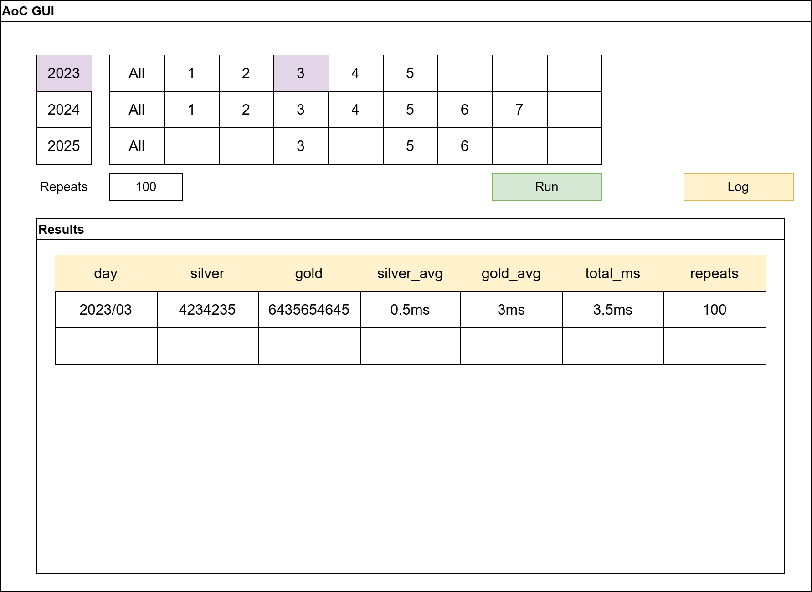
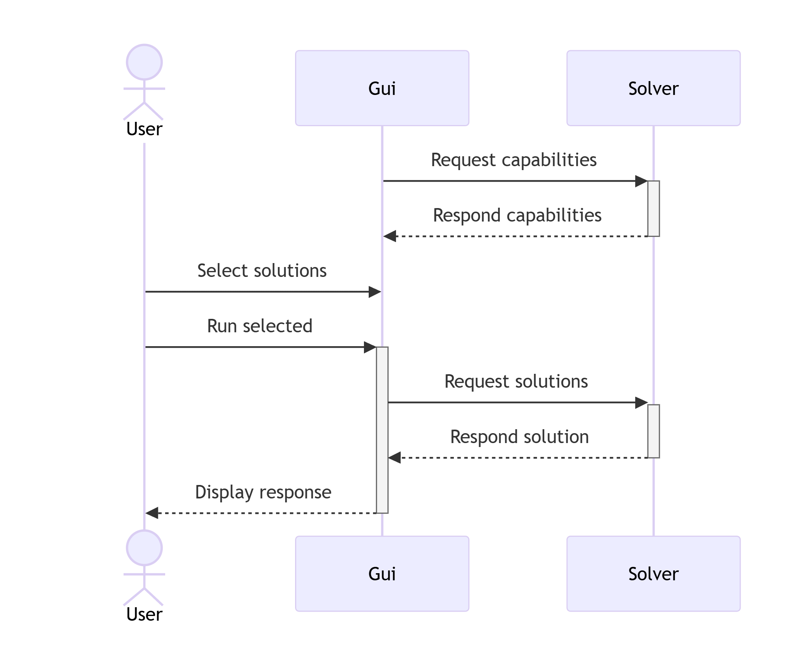

# Advent of Code QT C++ GUI solution runner

## Project Plan

Antti Hakkarainen

## Version History
| Version | Date       | Author   | Changes                     |
| ------- | ---------- | -------- | --------------------------- |
| 1.0     | 2026-01-02 | ahakkar  | Initial draft of plan       |
| 1.x     | 2026-01-02 | ahakkar  | |


## 1. Project description

The goal is to implement a C++ QT app with C++23, which communicates with an **external solver** via JSON in stdin/stdout. Another aim is to practice project documentation and design skills learned on school courses. The quality level of the project aims to be of high quality and  **presentable**, ideally it could be used as a showcase project.

JSON is used as the communication protocol with gui<>solver to allow the solver to be exchanged to another one following a common JSON specification.

At initialization the project will communicate with the solver, which .exe location is defined in a configuration file. The app queries the solver's capabilities - which solutions it has available for each year and day. Then the app will display a main window, which includes visual representation of the solver's capabilities with suitable UI elements. 

The user can then select which solutions he wants the solver to run - ie. all solutions from 2024, or perhaps day 07 from 2025 only. The app sends the command to solver and receives the solution and elapsed times. Additionally the user can select how many times each solution will be run, which eliminates the variance of individual runs.

The details of the project are expanded in following chapters, which tell how the project should look like and what requirements the project should meet.

## 2. Visuals

### 2.1 GUI app wireframe



### 2.2 Data flow 

Made with mermaid - https://mermaid.live/



```
sequenceDiagram
    actor User
    participant Gui
    participant Solver

Gui ->> +Solver: Request capabilities
Solver -->> -Gui: Respond capabilities

User ->> Gui: Select solutions 
User ->> +Gui: Run selected

Gui ->> +Solver: Request solutions
Solver -->> -Gui: Respond solution

Gui -->> -User: Display response
```

## 3. JSON specification

Writing a full JSON schema is a wrong abstraction level for the scope of the project. Provided is a human-readable desciption of how the JSON should look like.

stdin/out is cleared after each request/response.

```
{
  "version": 1,

  "requests": {
    "capabilities": {
      "request": {},
      "response": {
        "years": [2023, 2024],
        "days": [1, 2, 3, 4, 5, 6]
        "parts": ["silver", "gold"]
      }
    },

    "solution": {
      "request": {
        "year": 2024,
        "day": 5,
        "part": "silver",
        "repeats": 1
      },
      "response": {
        "result": "123456",
        "elapsed": 42,
        "elapsed_unit": "ms"
      }
    },

    "all": {
      "request": {
        "year": 2024
      },
      "response": {
        "solutions": [
          { "day": 1,
            "part": "silver",
            "result": "123", 
            "elapsed": 10, 
            "elapsed_unit": "us",
            "repeats": 100 
          },
          { "day": 1,
            "part": "gold",
            "result": "456",
            "elapsed": 12,
            "elapsed_unit": "ms",
            "repeats": 100 }
        ]
      }
    }
  },

  "errors": {
    "invalid_input": "Request parameters are invalid",
    "unsupported": "Requested feature not supported"
  },

  "transport": {
    "framing": "one JSON object per line over stdin/stdout",
    "encoding": "UTF-8"
  }
}
```


## 4. Requirements

## 5. References

## 6. Open issues

